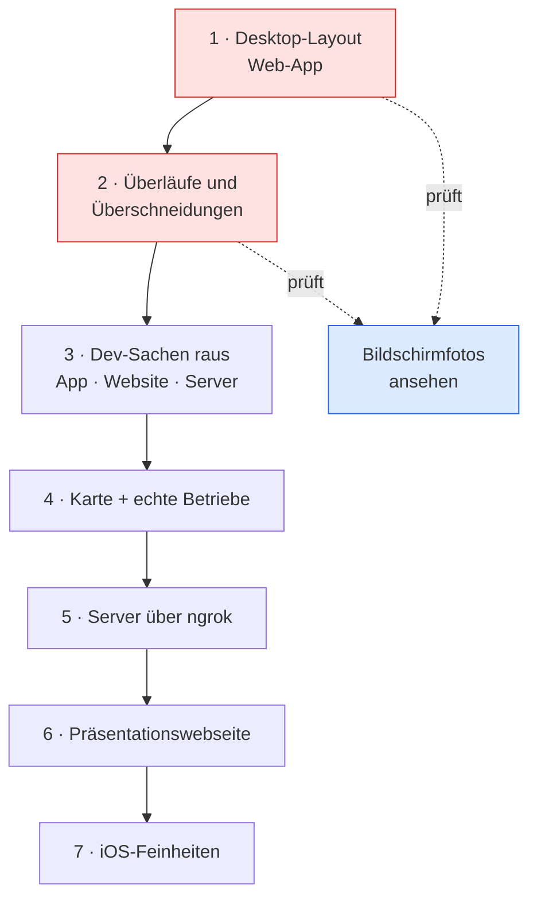

# Runde 8 — Desktop, echtes Design, echte Daten

**Status:** Hauptarbeit erledigt. Was offen blieb, steht unten und in
[[../00-produkt/OFFENE-PUNKTE]].

## Der Auftrag, wie ich ihn verstehe

Wörtlich kam sehr viel auf einmal. Sortiert nach der Ansage
*„größte Priorität … und zweitens …"*:

### Priorität 1 — Desktop

Die Web-App hat **kein Desktop-Design**. Was am Rechner erscheint, ist das
Handy-Layout in breit, samt unterer Leiste. Gewünscht ist es „wie bei
Instagram": eine eigene Anordnung für große Bildschirme, Navigation nicht
unten, Inhalt nicht in einer Spalte in der Mitte.

Wichtiger Hinweis aus dem Auftrag: *„du hattest schon ein gutes Desktop-Design,
das hast du aber irgendwie gelöscht."* → Vor dem Neubauen im Backup-Branch
`backup/monolith-2026-09-07` nachsehen, was es gab und warum es verschwand.

### Priorität 2 — Design in Ordnung bringen

*„keine Stellen, wo Texte raustragen, Texte die in andere Felder reinkreuzen."*
Dazu Verhältnisse, die nicht stimmen. Das ist kein Feinschliff, sondern der
Grund, warum es im Moment nicht vorzeigbar ist.

Auflage dabei: **per Bild selbst prüfen.** Nicht aus dem CSS schließen, dass es
passt, sondern hinsehen.

### Alles Weitere

| Was | Anmerkung |
|---|---|
| Dev-Sachen raus aus `App`, `Website-`, `Server` | `design` **behält** seinen Dev-Modus mit Beispielen. Die anderen drei sind die Versionen, die veröffentlicht werden |
| Alles vom Handy bedienbar | Es gibt keinen Laptop. Jeder Ablauf muss über GitHub Actions gehen |
| Server über ngrok | Fester Link liegt vor. Vom Handy startbar |
| Ohne Server keine kaputten Screens | Im Moment: App zeigt Fehler, Webseite geht nicht |
| OpenStreetMap einbauen | Ohne Label, einfach die Karte |
| Echte Betriebe | Alcossebre 25 km, 77836 Rheinmünster 30 km, 77704 Oberkirch 30 km |
| Anmeldeschranke | Liken, Speichern, Bewerten, Hochladen nur angemeldet — auch auf der Webseite |
| Die drei Symbole überarbeiten | Gemeint sind die Aktionssymbole an Videos/Betrieben |
| Präsentationswebseite | Vor der Web-App, im Stil von dropship.io, OpenAI, Claude, GitHub |
| iOS-Fähigkeit | Safari-Eigenheiten, Startbildschirm |
| Konten | Admin über Namen `topic` / `admin`; `test@gastro.de` und `test@user.de`, beide `12345aA?` |
| Dieses Brain | Bei **jeder** Aktion lesen und fortschreiben. Verknüpfungen, Grafiken |

## Was ich vorab klären musste

### Der APK-Bau ist nicht mehr kaputt

Im Auftrag steht *„eine App, die ich im Moment nicht bauen kann, weil der
Workflow einen Fehler hat"*. Das stimmte — bis Runde 7. Der Fehler lag an den
Capacitor-Dateien, die absichtlich nicht im Repository liegen und die niemand
erzeugte; siehe [[07-ohne-rechner]]. Lauf 3 ist grün durchgelaufen, die APK
liegt als Artefakt bereit.

Wahrscheinlich wurde ein älterer, roter Lauf gesehen. **Zu tun:** in der
Anleitung deutlich machen, welcher Lauf der gültige ist.

### Overpass ist von hier aus gesperrt

Die echten Betriebe kommen aus OpenStreetMap. Der Netzzugang dieser Umgebung
lässt `overpass-api.de` nicht durch (Egress-Policy, 403 auf CONNECT). Von
GitHub-Runnern aus geht es.

**Folge:** Der Datenimport wird ein Workflow, der die Daten holt und einträgt.
Das passt ohnehin besser — er ist damit auch vom Handy auslösbar, und
wiederholbar, wenn die Gegenden sich ändern.

### Google Maps geht nicht, OpenStreetMap schon

Gefragt war „alle Restaurants, die du in Google Maps findest". Die Daten von
Google sind lizenzrechtlich nicht übernehmbar und ohne Bezahlkonto auch nicht
abrufbar. OpenStreetMap liefert für diese drei Gegenden dieselben Betriebe,
ist frei nutzbar (ODbL, Namensnennung genügt) — und ist ohnehin die Quelle,
die im Konzept für den Import vorgesehen war. Ich nehme also OSM.

## Zwei Dinge, die ich nicht so mache, wie es dasteht

### Der ngrok-Token kommt nicht ins Repository

Er stand im Klartext im Auftrag. Er kommt als **GitHub Secret** hinein, nicht
als Datei, nicht in eine gitignorierte Datei, nicht in den Workflow.

Und: Er sollte im ngrok-Dashboard **neu erzeugt** werden. Ein Token, der einmal
durch einen Chatverlauf gelaufen ist, ist verbrannt — wer ihn hat, kann Tunnel
auf dieses Konto aufmachen.

### Der Admin-Zugang `topic` / `admin` bleibt vorläufig

So gewünscht, so gebaut. Aber er wandert in [[SCHRITT-2-DEV-ENTFERNEN]] ganz
nach oben, mit einer harten Grenze: **Bevor die Webseite echte Nutzerdaten
sieht, muss dieser Zugang weg.** `admin` als Passwort ist in jeder Wortliste,
die es gibt.

## Reihenfolge



Desktop und Design zuerst, weil beides an derselben Stelle sitzt und ein
zweiter Durchgang durch dieselben Dateien Verschwendung wäre. Die Dev-Sachen
danach, weil sie beim Prüfen noch nützlich sind — sobald sie weg sind, komme
ich nicht mehr in zwei Klicks in eine Gastro-Rolle.

## Befund: Es wurde nichts gelöscht — es war nie da

Im Auftrag steht, das gute Desktop-Design sei irgendwann gelöscht worden. Ich
habe im Backup-Branch nachgezählt: **19 Desktop-Regeln damals, 19 heute.**
Verloren gegangen ist nichts.

Der wahre Befund ist unangenehmer. Es gibt zwei Sorten von Screens:

| Screen | Am Desktop | Urteil |
|---|---|---|
| Verwaltung (`/admin`) | Seitenleiste links, Kacheln, Tabelle | **funktioniert** |
| Gastro-Konsole | dasselbe Muster | **funktioniert** |
| Karte | Liste links, Karte rechts | brauchbar, Zeilen zu eng |
| Speisekarte | schmale Spalte, mittig | **richtig so** — eine Karte liest man schmal |
| Startseite | Handy-Layout, auf 1440 px gezogen | **kaputt** |
| Feed | dito | **kaputt** |
| Profil | Bild mittig, Name mittig, Zahlen mittig | **kaputt** — das ist die Handy-Ansicht |
| Betriebsseite | eine Spalte über die volle Breite, halbe Seite leer | **kaputt** |

Das Muster: Wo eine **Konsole** gebaut wurde, gibt es ein Desktop-Layout. Wo
ein **öffentlicher Screen** gebaut wurde, wurde vom Handy aus gedacht und für
breit nur die Schriftgröße stehen gelassen.

Wahrscheinlich ist genau das gemeint mit „du hattest schon ein gutes
Desktop-Design": die Verwaltungsansicht. Die ist nie verschwunden — sie war nur
nie auf den öffentlichen Teil übertragen worden.

### Was am Profil außerdem auffiel

Unter dem Namen stehen „Videos · Follower · Folgt" — **ohne Zahlen**. Das ist
kein Layout-Fehler, das ist ein fehlender Wert. Beim Hinsehen gefunden, nicht
beim Lesen des Codes. Genau dafür sind die Bilder da.

## Was am Desktop gebaut wurde

Ein neues Stylesheet `design/src/styles/desktop.css`. Alles darin steht in
`@media (min-width: 1024px)` — unterhalb davon ändert sich keine einzige
Regel, das Handy-Layout bleibt unangetastet.

| Screen | Vorher | Jetzt |
|---|---|---|
| Alle App-Screens | Kopfleiste, sonst nichts | Seitenleiste links: Feed · Karte · Suche · Profil. Ab 1024px Symbole, ab 1280px mit Beschriftung |
| Profil | Bild mittig, alles darunter | Bild links, Name, Zahlen, Text und Knöpfe rechts daneben |
| Betriebsseite | eine Spalte, halbe Seite leer | Zwei Spalten. Links Videos, Speisekarte, Bewertungen. Rechts ein Steckbrief, der beim Scrollen stehen bleibt |
| Feed | schwarze Fläche über 1440px | Rahmen im Verhältnis 9:16, mittig; Aktionen rechts daneben, Blättern links |

### Die Falle im Feed

Ab 1024px blendet das CSS die untere Leiste aus. Der Feed ist eine
`FullscreenPage` — die hatte nie eine Kopfleiste und bekam auch keine
Seitenleiste. Ergebnis: **Am Rechner gab es im Feed überhaupt keine
Navigation.** Der einzige Ausweg war der Zurück-Knopf des Browsers.

Das stand in keinem Test, weil kein Test fragt „komme ich hier wieder weg". Im
Bild sieht man es sofort.

### Die Rahmen-Rechnung, die zweimal falsch war

Der Feed-Rahmen sitzt mittig, und Aktionsleiste und Blätterknöpfe richten sich
an seinen Kanten aus. Beim ersten Versuch habe ich den linken Randabstand für
den rechten wiederverwendet — das stimmt nur, solange der Rahmen mittig im
Fenster steht. Sobald links die Seitenleiste dazukam, lagen die Aktionen
plötzlich **im** Bild und kreuzten den Bildtext.

Jetzt stehen beide Abstände getrennt als Variablen an `.feed`, und die
Seitenleistenbreite geht als `--nav-b` in die Rechnung ein.

## Überläufe, erster Schwung

Beide auf dem Handy gefunden — also genau dort, wo sie am meisten stören:

**1. Fünf Knöpfe auf 390 Pixel.** Die Aktionsleiste zeigte Speisekarte, Route,
Anrufen, Speichern und Teilen nebeneinander. Macht 65px pro Knopf; „Speisekarte“
passt da nicht hinein und lief heraus.

Der Grund war nicht das CSS, sondern eine Doppelung: **Speichern und Teilen
stehen auf dem Handy schon als Symbole im Titelbild.** Sie fallen unter 1024px
jetzt weg — drei Knöpfe zu 114px, alles lesbar. Am Rechner ist Platz, dort
stehen weiter alle.

**2. Abgeschnittene Reiter.** „Bewertungen“ und „Gespeichert“ endeten an der
Bildschirmkante. Technisch war nichts kaputt — die Zeile scrollt. Nur sah man
das nicht. Jetzt blendet eine weiche Maske die Kante aus; ein halb sichtbares
Wort heißt „hier geht es weiter“ statt „hier ist etwas kaputt“.

## Serverausfall: eine Falschaussage, keine Störungsmeldung

Im Auftrag stand nur ein Halbsatz — *„wenn der Server nicht verfügbar ist,
dann gibt es in der App Fehler"*. Beim Nachstellen war es schlimmer als
erwartet. Auf der Startseite stand dann:

> In deinem Umkreis wurden noch keine Videos hochgeladen.

Das ist keine Störungsmeldung. Das ist eine **Aussage über den Inhalt**,
während in Wahrheit gar keine Verbindung zustande kam. Wer das liest, sucht
den Fehler bei sich oder hält die App für leer.

Der Grund: Ein gescheiterter Aufruf und ein leeres Ergebnis sahen in der
Oberfläche gleich aus. `request()` unterscheidet jetzt drei Fälle — kommt gar
nicht an (Server aus, WLAN weg, Tunnel abgelaufen), antwortet mit 5xx, oder
antwortet mit einem fachlichen Nein. Die ersten beiden melden die Verbindung
als weg; ein Aufruf, der durchkommt, meldet sie zurück und lässt alle
Abfragen neu laufen.

Darüber sitzt ein Band mit Erklärung und einem Knopf. `tools/verbindung.mjs`
prüft die ganze Schleife: Server da, Server weg, Wiederholen ohne Server,
Wiederholen mit Server. 5 von 5.

**Offen geblieben:** Die einzelnen Leerzustände sagen weiterhin ihren Satz
über den Inhalt. Das Band darüber erklärt es zwar, aber sauber wäre, wenn
jeder Leerzustand wüsste, warum er leer ist. Steht in den offenen Punkten.

## Karte: echte Kacheln, und eine alte Verzerrung

Eingebaut ohne Kartenbibliothek. MapLibre oder Leaflet bringen 40 bis 250 KB
mit und wollen ihre eigene Zustandsverwaltung; gebraucht wird hier ein Raster
aus Bildern an der richtigen Stelle. Das sind dreißig Zeilen Rechnung in
`Website-/src/lib/map.js`.

Dabei kam ein Fehler heraus, der vorher niemandem auffallen konnte:

> Die alte Markerrechnung nahm für die **Höhe denselben Maßstab wie für die
> Breite**. Das stimmt nur bei einem quadratischen Kasten. Auf der breiten
> Karte am Rechner war alles senkrecht auseinandergezogen.

Solange nichts darunter lag, sah man es nicht — es gab keine Bezugslinie.
Sobald echte Kacheln daruntergelegt werden, wandert das Restaurant zwei
Straßen neben sein Haus. Jetzt rechnen Kacheln und Marker beide in
Web-Mercator, aus derselben Funktion.

**Kacheln kann ich von hier nicht sehen:** Der Netzzugang dieser Umgebung
lässt `tile.openstreetmap.org` nicht durch, genau wie Overpass. Deshalb prüft
`tools/karte-pruefen.mjs` die Rechnung mit Zahlen statt mit Augen: Mittelpunkt
in der Mitte, ein Kilometer nach Osten so lang wie ein Kilometer nach Norden,
Norden oben, keine Lücke am Rand, gültige Zoomstufen von 0,5 bis 2000 km.
17 von 17.

Zum Label: Ganz ohne geht es nicht. Die Kacheln stehen unter der ODbL, und die
verlangt eine Namensnennung. Es ist ein 10px-Vermerk unten rechts geworden —
kleiner geht, aber weglassen wäre eine Lizenzverletzung.

## Dev-Sachen raus

Aus `App`, `Website-` und `Server`. Das `design`-Repo behält seinen Dev-Modus
mit Beispielen — dort gehört er hin, das ist die Werkstatt.

Die Streichliste steht in [[../04-naechste-schritte/SCHRITT-2-DEV-ENTFERNEN]],
mit dem, was bewusst geblieben ist.

**Ein Fehler beim Aufräumen, festgehalten weil er lehrreich ist.** Der
Zustandsschalter `useVariant(…)` steckte an 21 Stellen. Mein erster Versuch
löste ihn mechanisch auf: öffnende Klammer suchen, passende schließende
zählen, Inhalt einsetzen. Das ging schief, weil solche Aufrufe über mehrere
Zeilen gehen und **vor der schließenden Klammer ein Komma steht**:

```js
const { data } = useVariant(
  useQuery(…, { initial: [] }),
)
```

Nach dem Auflösen blieb `const { data } = useQuery(…),` stehen — die nächste
Zeile begann mit `const`, und der Bau brach ab. Nebenbei traf derselbe Lauf
die Definition selbst und machte daraus `export function result {`.

Zurückgesetzt, das Komma beim Auflösen mitgenommen, neu gemacht. Die Lehre ist
nicht „keine mechanischen Umbauten", sondern: **danach bauen, bevor man
weitermacht.** Der Bau hat es in drei Sekunden gefunden.

**Der wichtigste Punkt war gar kein Dev-Ding, sondern ein Loch.**
`POST /api/reset` löschte den ganzen Datenbestand ohne jeden Nachweis.
Auf dem eigenen Rechner bequem. Hinter dem ngrok-Link, den wir in derselben
Runde gebaut haben, ist es ein Löschknopf für jeden, der die Adresse kennt.
Jetzt nur für die Verwaltung: ohne Anmeldung 403, als Nutzer 403, als
Verwaltung 200.

## Verlauf dieser Runde

*(wächst mit)*

- **Aufgenommen.** Auftrag sortiert, zwei Widersprüche geklärt (APK läuft
  wieder; Google Maps → OpenStreetMap), Overpass-Sperre umgangen über einen
  Workflow. Token-Warnung ausgesprochen.
- **Hingesehen statt geraten.** `tools/bilder.mjs` gebaut: fotografiert alle
  Screens in vier Breiten und meldet nebenbei jeden waagerechten Überlauf.
  Befund unten.
- **Priorität 1 erledigt.** Seitenleiste, Profil, Betriebsseite, Feed. Dabei
  eine Falle gefunden, die schlimmer war als das Layout: Am Rechner **kam man
  aus dem Feed nicht mehr heraus.**
- **Überläufe behoben** (Priorität 2), in vier Breiten nachgesehen.
- **Echte Betriebe**, Serverstart und Kartendaten als Ablauf — alles drei vom
  Handy auslösbar.
- **Karte mit echten Kacheln**, dabei eine alte Verzerrung gefunden.
- **Serverausfall** wird gesagt statt als leerer Inhalt ausgegeben.
- **Präsentationsseite** vor der Anwendung.
- **Entwicklerzeug raus** aus App, Website und Server.
- **Ein Loch geschlossen**, das erst durch ngrok eins wurde.


## Nachträge aus dem Gespräch

### „Passwort vergessen?" — zweimal falsch gesessen

Erst klebte die Zeile am Passwortfeld (negativer Abstand), dann hatte sie zwar
Luft, saß aber weiter zwischen Feld und Knopf. Der eigentliche Fehler war die
**Stelle**, nicht der Abstand: Dort trennt sie das Formular von seiner Aktion.

Instagram, Spotify, Netflix und Apple setzen den Link **unter den
Anmelde-Knopf**, mittig. Das ist auch logisch — es ist der Ausweg für den Fall,
dass der normale Weg nicht klappt, und den sucht man nicht vor dem Versuch.
Damit fällt der Sonderabstand ganz weg; die Zeile ist ein gewöhnliches Element
im Formular.

### Die Anwendung fängt mit dem Feed an

*„Diese ‚Sieh, was es zu essen gibt'-Seite gibt es bei der Handy- und der
Web-App-Version nicht … das soll gleich mit dem Feed anfangen."*

`/` entscheidet jetzt:

| Wer | Landet auf |
|---|---|
| Browser, nicht angemeldet | Präsentationsseite |
| Browser, angemeldet | `/feed` |
| App | `/feed` — ohne Anmeldung `/anmelden` |

Das ist genau das Instagram-Modell, das im Auftrag als Vorbild genannt wurde:
eingeloggt der Feed, ausgeloggt die Seite, die erklärt, worum es geht. Die
Präsentationsseite ist damit nicht weg — sie steht nur nicht mehr im Weg.

### Die Suche schlägt etwas vor

Unter den Chips war weiße Fläche. Dabei ist das die Stelle, an der man sich
umsieht, ohne zu wissen wonach — Instagram macht daraus sein Explore. Jetzt
steht dort ein Raster mit Videos aus der Gegend und darunter die Betriebe.

### Ein Test, der an einem Entwicklerstück hing

„Profil zeigt beim Laden eine Ladeanzeige" schlug fehl, sobald die künstliche
Verzögerung entfernt war. Das war kein Fehler im Programm: Im Alleinbetrieb
liegen die Daten im selben Browser, es gibt nichts zu warten.

Die Prüfung ist nach `gegen-server.mjs` gewandert. Dort gibt es einen echten
Aufruf, der sich verzögern lässt — und damit einen echten Ladezustand statt
eines nachgestellten.

**Die Lehre:** Ein Test, der nur wegen eines Entwicklerstücks grün war, hat nie
das geprüft, was er behauptete.

## Was diese Runde gekostet hat, und was sie wert war

Drei Sachen sind aufgefallen, die **kein Test gefunden hätte** und die man nur
sieht, wenn man hinsieht oder es wirklich ausprobiert:

1. **Am Rechner kam man aus dem Feed nicht mehr heraus.** Kein Test fragt
   „komme ich hier wieder weg".
2. **Die Marker waren senkrecht verzerrt.** Ohne Karte darunter fehlte die
   Bezugslinie — der Fehler war unsichtbar, bis etwas Echtes danebenlag.
3. **Ohne Server behauptete die Seite, es gäbe keine Videos.** Das ist keine
   Störungsmeldung, sondern eine Falschaussage.

Dazu ein viertes, das erst durch die eigene Arbeit entstand: `POST /api/reset`
war auf dem eigenen Rechner harmlos. Sobald derselbe Server über ngrok
öffentlich wird, ist es ein Löschknopf für jeden, der die Adresse kennt.
**Jede Änderung an der Erreichbarkeit ändert, was ein Endpunkt bedeutet.**

## Offen geblieben

- **Kartenbedienung.** Kacheln und Marker stimmen, aber Verschieben und Zoomen
  mit der Maus gibt es noch nicht. Der Umkreisregler ersetzt das nur halb.
- **Leerzustände wissen nicht, warum sie leer sind** — siehe offene Punkte.
- **Der Datenimport ist noch nicht gelaufen.** Der Ablauf steht, aber Overpass
  ist von hier gesperrt; der erste echte Lauf passiert auf GitHub.
- **Das ngrok-Secret fehlt.** Ohne `NGROK_AUTHTOKEN` bricht der Ablauf gleich
  im ersten Schritt ab, mit einem Hinweis darauf.
- **Die drei Symbole.** Im Auftrag stand, „diese drei Symbole" müssten
  überarbeitet werden. Es ist nicht eindeutig, welche gemeint sind — im Feed
  sind es sechs, im Titelbild zwei, am Profil drei. Nachgefragt statt geraten.
