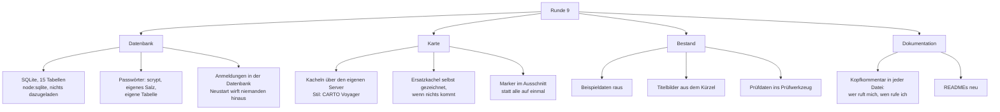

# Runde 9 — Datenbank, Karte, MVP startklar

> Die Runde, in der aus einem Prototyp etwas wurde, das man anfassen kann,
> ohne dass beim Neustart alles weg ist.

## Der Auftrag, wie ich ihn verstanden habe

Wörtlich war es: „wir vernachlässigen jz erstmals die Website und Web App und
gehen an die App und den Server". Dahinter standen acht Dinge:

1. Den gesamten Code durchgehen und **Verlinkungen, Abhängigkeiten und
   Erklärungen als Kommentare** verteilen.
2. **Alle .md-Dateien** auf den Stand bringen — und in Zukunft auch.
3. **Userprofile in Datenbanken**, wie es Firmen professionell machen.
4. **Beispieldaten weg**, und einen **Überspringen-Knopf** bei der
   Verifizierung von Handynummer und E-Mail.
5. **MVP startklar**, und Daten, die **einen Neustart des Servers überleben**.
6. Die **Karte weltweit, serverseitig**, im Design von Google Maps, mit den
   Betrieben der drei Gegenden.
7. Die **Seiten aus den Kartendaten**, mit Bildern. **Keine übernommenen
   Bewertungen.**
8. **Noch keine Userprofile für die Gastros.**

### Was „Website vernachlässigen" nicht heißen kann

Die App ist eine Hülle um die gebaute Website — sie *enthält* keine eigenen
Screens (siehe [[02-technik/AUFTEILUNG]]). „An der App arbeiten" und „die
Website nicht anfassen" schließen sich deshalb aus.

Gemeint ist etwas anderes, und danach habe ich gehandelt: **Die
Präsentationsseite und der Feinschliff am Desktop-Layout ruhen.** Was in der
App zu sehen ist — Betriebsseiten, Karte, Verifizierung, Einstellungen —
gehört zur App und wurde angefasst.

## Was gebaut wurde



### Die Datenbank

`node:sqlite` steckt seit Node 22.5 in Node selbst. Damit gibt es eine
richtige Datenbank, ohne dass `npm install` irgendetwas nachlädt — was für
dieses Projekt seit Runde 6 die Bedingung ist.

- **15 Tabellen** mit Typen, Bedingungen und Indizes. Das Schema steht als
  Beschreibung in JavaScript, nicht als `.sql`: Der Store muss ohnehin wissen,
  welche Felder Wahrheitswerte sind (SQLite kennt keine) und welche
  verschachtelt (die kommen als JSON in eine Textspalte). Zwei Quellen dafür
  wären zwei Quellen, die auseinanderlaufen.
- **Passwörter** liegen in `zugaenge`, gehasht mit scrypt und je Konto eigenem
  Salz, verglichen mit `timingSafeEqual`. Im Nutzerobjekt gibt es **kein**
  Passwortfeld mehr. Vorher stand es im Klartext daneben, und an drei Stellen
  im Code musste daran gedacht werden, es wieder herauszunehmen. Eine davon zu
  vergessen hätte gereicht.
- **Anmeldungen** stehen ebenfalls in der Datenbank. Vorher lagen sie in einer
  Map im Arbeitsspeicher — jeder Neustart hat alle Angemeldeten hinausgeworfen,
  mitten in dem, was sie gerade taten. Über ngrok startet der Server öfter, als
  einem lieb ist.

Gelesen wird aus dem Arbeitsspeicher, geschrieben sofort in die Datenbank.
Warum, und wann das nicht mehr reicht (nämlich sobald zwei Serverprozesse auf
dieselbe Datei zeigen), steht oben in `src/store/sqlite-store.js`.

Geprüft wird das mit einem echten Neustart: `test/datenbank.mjs` fährt den
Server herunter, schließt den Store und startet beides neu aus derselben
Datei. Ein Test, der denselben Store weiterbenutzt, würde genau das nicht
prüfen.

### Die Karte

Sie läuft jetzt **über den eigenen Server**:

```
GET /api/karte/stil                    Stil und Namensnennung
GET /api/karte/kachel/:z/:x/:y.png     eine Kachel, weltweit
GET /api/karte/betriebe?nord=…         Marker in einem Ausschnitt
GET /api/bild/betrieb/:slug.svg        Titelbild eines Betriebs
```

Vier Gründe, alle praktisch: **ein Ausgang** (die App spricht mit einer
einzigen Adresse), **ein Zwischenspeicher** auf der Serverplatte (jede Kachel
wird einmal geholt), **Höflichkeit** gegenüber den freien Kachelservern, die
von Spenden leben, und **ein Stilwechsel bleibt eine Zeile**.

Zum Stil: Gewünscht war „so wie Google Maps". Googles Kacheln dürfen nur über
deren SDK benutzt werden und brauchen ein Bezahlkonto. **CARTO Voyager** kommt
demselben Bild am nächsten — heller entsättigter Grund, farbige Straßen nach
Rang, grüne Parks, zurückhaltende Beschriftung. Die Daten sind wie überall
OpenStreetMap.

Kommt keine Kachel durch, zeichnet der Server eine: ein PNG von Hand, ruhiger
Grund mit feinem Raster. Eine Karte mit vierzig kaputten Bildsymbolen sieht
schlimmer aus als eine leere, und die Marker sitzen trotzdem richtig.

### Der Bestand

Die erfundenen Berliner Betriebe, Videos, Bewertungen, Meldungen und
Speisekarten sind **weg**. Übrig bleiben die 360 importierten Betriebe und die
drei bestellten Zugänge.

Der Feed ist damit am ersten Tag leer. Das ist kein Fehler, sondern der
Zustand jeder Anwendung am ersten Tag — und es war die eigentliche Gefahr an
den Beispieldaten: Niemand hätte von außen erkennen können, was echt ist und
was Kulisse, und die ersten echten Beiträge hätten zwischen erfundenen
gestanden.

Was zum Prüfen gebraucht wird, steht jetzt im Prüfwerkzeug
(`Website-/tools/pruefbestand.mjs`) und nirgends im Programm. Ein Betrieb
„Prüf-Trattoria" mit Speisekarte, Videos und Bewertungen — sichtbar als das,
was er ist.

### Bilder

Zu den Betriebsseiten gehören Bilder. Fotos gibt es dafür nicht:

- Die Fotos bei Google Maps gehören denen, die sie gemacht haben.
- OpenStreetMap führt bei einigen wenigen ein `image`- oder
  `wikimedia_commons`-Merkmal. Wo es das gibt, wird es benutzt — das sind
  deutlich unter fünf Prozent.
- Ein Stockfoto von irgendeinem Restaurant wäre eine Behauptung über einen
  Betrieb, den niemand fotografiert hat.

Also ein Bild, das ehrlich ist: ein ruhiger Verlauf mit dem
Anfangsbuchstaben, aus dem Kürzel gerechnet, also für denselben Betrieb immer
derselbe. Die Seite sieht vollständig aus, ohne etwas vorzugeben. Sobald ein
Betrieb sein Konto übernimmt, lädt er ein echtes Foto hoch und dieses
verschwindet.

### Keine übernommenen Bewertungen

Ausdrücklich bestellt und ohnehin die einzige haltbare Antwort: Eine fremde
Sternezahl sagt nichts darüber, *was* bewertet wurde, lässt sich nicht
nachvollziehen und wäre eine Behauptung über einen Betrieb, die wir nicht
belegen können. `tools/orte-pruefen.mjs` prüft, dass keine hereinkommt — auch
nicht, wenn jemand später ein Feld „mitnimmt".

## Was dabei kaputt war

### Die eigenen Konten brachen die eigene Regel

Die bestellten Zugänge hießen `test-user` und `test-gastro`. Die Regel für
Benutzernamen lässt keinen Bindestrich zu. Anmelden ging — aber sobald jemand
sein Profil geöffnet und gespeichert hätte, hätte das Formular den eigenen
Namen zurückgewiesen, und zwar ohne dass irgendetwas dabei erklärt, warum.

Gefunden hat das ein Verhaltenstest, nachdem er auf die neuen Konten
umgestellt war. Vorher lief er gegen `max@beispiel.de` und war grün.

Zwei Lehren:

1. **Ein Ausgangsbestand ist Code und muss die eigenen Regeln einhalten.**
   Der Rauchtest prüft das jetzt.
2. **Die Regel stand nur im Formular.** Wer den Aufruf direkt schickt, kam
   daran vorbei. Sie steht jetzt in der Fachlogik, wo sie hingehört.

### Ein fehlender Wert war nicht „fehlt", sondern „null"

`Number(null)` ist `0`, nicht `NaN`. Die Kartenabfrage las ein fehlendes `max`
deshalb als „höchstens null Marker" und gab eine leere Liste zurück. Die Karte
blieb leer, und es sah nach einem Datenproblem aus.

Derselbe Fehler war Runde 8 schon einmal da, bei `/api/places`. Zweimal
dieselbe Falle heißt: Es ist keine Unachtsamkeit, sondern eine Eigenschaft der
Sprache, gegen die man einmal eine Hilfsfunktion schreibt.

### Der Import schrieb ein Feld, das gerechnet wird

`verified` stand in den importierten Daten **und** wurde in `derive.js` aus
`claimStatus` berechnet. Solange beide dasselbe sagten, fiel es nicht auf. Der
neue Store hat es gemeldet, weil es keine Spalte dafür gibt — und das war
richtig so.

### Der Platzhalter stand wörtlich auf der Seite

Auf jeder angereicherten Betriebsseite stand „Stand {date}". Der
Übersetzungsschlüssel benutzte `{date}`, das System `{{date}}`. Kein Test
prüft Platzhalter; **das Bildschirmfoto hat es gezeigt.** Wieder.

## Nachtrag: drei Korrekturen mitten in der Runde

### Der Kartenstil

Zuerst hatte ich CARTO Voyager genommen, weil „so wie Google Maps" bestellt
war. Die Rückmeldung war eindeutig: **der gewöhnliche OpenStreetMap-Stil**,
nicht die Verkehrsansicht.

Jetzt ist `standard` der Standard. Voyager bleibt als Wahl, über eine
Umgebungsvariable statt über eine Codeänderung:

```
KARTE_STIL=voyager node src/index.js
```

Die Namensnennung wandert mit — sie hängt am Stil, nicht am Code.

### Das Menü sah nicht aus wie ein Menü

Die untere Leiste stand als **„FEED · KARTE · SUCHE · PROFIL"** da:
Großbuchstaben mit Sperrung. Der Grund war eine falsch gewählte Klasse —
`.t-tiny`, gedacht für Tabellenköpfe.

Kein Telefon beschriftet seine Navigationsleiste so. Neue Klasse
`.nav-label`, gewöhnliche Schreibweise, keine Sperrung.

Beim Nachsehen fielen zwei weitere Dinge auf, die aus demselben Grund falsch
aussahen — ein Symbol an der falschen Stelle:

- **Die Kartenmarker** waren graue Kreise mit einem durchgestrichenen
  Besteck. Das ist das Symbol für „Bild fehlt". Auf einer Karte sah es aus,
  als wäre etwas kaputt — und ein Kreis *um* den Punkt zeigt auf alles im
  Umkreis, nicht auf den Punkt. Jetzt Tropfen mit der Spitze auf der
  Koordinate, wie auf jeder Karte.
- **Die Betriebszeilen** zeigten denselben Platzhalter, zwanzigmal
  untereinander. Jetzt steht dort das Titelbild.

### Keine Seiten für Betriebe, die es nicht gibt

OpenStreetMap kennt kein Feld „geschlossen". Wer einen Betrieb nicht löschen
will, schreibt es in den Namen: „Lempert (dauerhaft geschlossen)". Auf einer
Betriebsseite stand das dann als Name — und es gab eine Seite für ein Lokal,
zu dem niemand mehr hinfahren sollte.

`src/data/zustand.js` trennt Name und Zustand. Dauerhaft Geschlossene kommen
gar nicht erst in den Bestand; vorübergehend Geschlossene bleiben mit
Hinweis, sonst verschwände jedes Lokal in den Betriebsferien.

Angewandt wird das **beim Import und beim Laden**. `orte.js` kann aus einem
Lauf stammen, der die Regel noch nicht kannte — genau das war der Fall. Ein
Bestand, der sich beim Laden selbst prüft, ist einer weniger, bei dem man an
den richtigen Zeitpunkt denken muss.

### Und einmal Nein: Bilder von Google

Zweimal gewünscht, zweimal nicht möglich — und das liegt nicht am Aufwand:

- Die Fotos bei Google Maps gehören **den Menschen, die sie gemacht haben**.
  Google gibt sie nicht weiter; sie herunterzuladen und selbst auszuliefern
  wäre eine Urheberrechtsverletzung gegenüber Dritten, nicht gegenüber
  Google.
- Die Nutzungsbedingungen der Google-Maps-Dienste verbieten das Speichern
  und Weiterverwenden ausdrücklich.
- Technisch käme man ohnehin nur mit einem Bezahlkonto und deren SDK heran,
  und auch dort dürfen Fotos nur zur Anzeige in einer Google-Karte benutzt
  werden.

Was stattdessen geht und eingebaut ist:

1. **Wikimedia Commons und `image` aus OpenStreetMap** — echte Fotos, frei
   lizenziert, mit Nennung. Der Import nimmt sie mit, wo es sie gibt (unter
   fünf Prozent der Betriebe).
2. **Gezeichnete Titelbilder** für alle anderen — ehrlich, immer da, und
   sie behaupten nichts.
3. **Der Betrieb selbst.** Wer sein Konto übernimmt, lädt sein eigenes Foto
   hoch. Das ist ohnehin das bessere Bild.

## Was offen bleibt

- **Ein Kachelserver mit eigenen Daten.** Der Zwischenspeicher ist höflich,
  aber vor einer echten Veröffentlichung braucht es eigene Kacheln.
- **`topic` / `admin`.** Das Platzhalterpasswort steht in jeder Wortliste.
  Der Server erinnert bei jedem Start daran, solange es gilt.
- **Der Alleinbetrieb im Browser.** Er ist bequem, verdeckt aber, dass ohne
  Server nichts geteilt wird. Sobald ngrok fest steht, sollte er nur noch
  Rückfallebene sein.
- **Das Datenbank-Artefakt.** Wer das Repository lesen darf, kann es
  herunterladen. Darin stehen E-Mail-Adressen und Passwort-Hashes. Für drei
  Testzugänge vertretbar, für echte Menschen nicht.

→ zurück zu [[STAND]] · vorherige Runde [[03-verlauf/08-desktop-und-echte-daten]]
