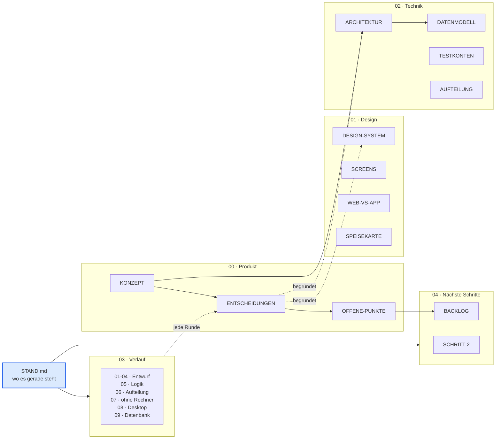

# Brain — Wissensspeicher zum Projekt

Hier steht alles, was man über dieses Projekt wissen muss, ohne den Code zu
lesen: Konzept, Entscheidungen, Architektur, Verlauf und die nächsten Schritte.

Der Code liegt woanders (siehe `REPOS.md`). Dieses Repository ist die
gemeinsame Erinnerung — wenn ein neuer Chat, ein neuer Mensch oder ein neuer
Agent dazukommt, reicht es, hier zu lesen.

## Wo fange ich an?

| Ich will … | Datei |
|---|---|
| **wissen, wo es gerade steht** | **`STAND.md`** — die lebende Seite |
| **es selbst ausprobieren** | **`SELBST-TESTEN.md`** |
| es ohne Rechner ausprobieren, nur am Handy | `OHNE-RECHNER.md` |
| wissen, was in welchem Repository liegt | `REPOS.md` |
| verstehen, was gebaut wird | `00-produkt/KONZEPT.md` |
| wissen, warum etwas so ist | `00-produkt/ENTSCHEIDUNGEN.md` |
| den Stand des Entwurfs sehen | `01-design/SCREENS.md` |
| verstehen, wie die Logik gebaut ist | `02-technik/ARCHITEKTUR.md` |
| mich anmelden und ausprobieren | `02-technik/TESTKONTEN.md` |
| wissen, was bisher passiert ist | `03-verlauf/` |
| wissen, was als Nächstes kommt | `04-naechste-schritte/` |

## Die Karte

## Regeln für dieses Repository

1. **`STAND.md` wird bei jeder Aktion angefasst.** Nicht am Ende einer Runde,
   sondern währenddessen. Wer hier liest, soll nie einen veralteten Stand
   sehen.
2. **Jede Runde bekommt eine Datei** in `03-verlauf/` — was gefragt war, was
   gemacht wurde, was geprüft wurde, was offen blieb. Auch das Denken dazu:
   Widersprüche im Auftrag, verworfene Wege, Dinge, die anders gemacht wurden
   als gesagt, mit Begründung.
3. **Entscheidungen kommen in `ENTSCHEIDUNGEN.md`** — kurz, mit Datum und
   Begründung. Auch verworfene Wege, sonst diskutiert man sie wieder.
4. **Keine Geheimnisse hier ablegen.** Keine echten Zugangsdaten, keine
   Schlüssel, keine Kundendaten. Die Testkonten in `TESTKONTEN.md` sind
   erfunden und gelten nur für den Prototyp. Zugangstoken für Dienste
   (ngrok, später Supabase) gehören in **GitHub Secrets**, nie in eine Datei.
5. **Lieber ein Satz zu viel als eine Frage später.** Wer das hier liest,
   war beim Gespräch nicht dabei.
